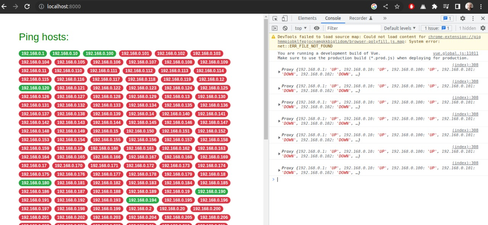
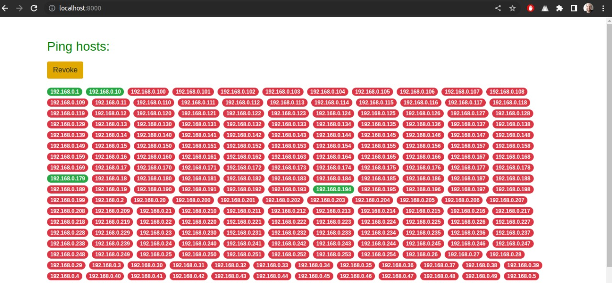
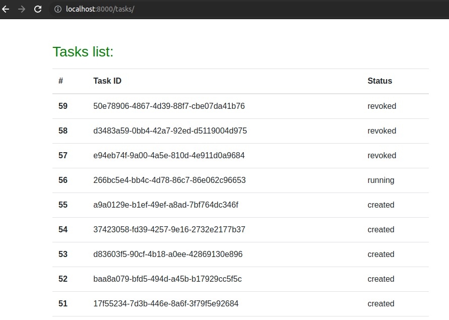

# ping_project

## Description
ping hosts in local network through Async task (Celery), multi-threading and websockets (Django Channels and Vue).

## Screenshot

### Receive json from websocket

### Revoke current async task

### Tasks list
